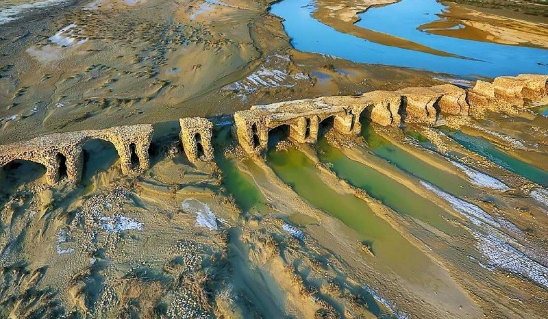

<div align="center" dir="rtl">

# 🏛 روستای لاتیدان (کلمتلی)

### طولانی‌ترین پل تاریخی ایران در قلب هرمزگان



[](https://aminghadery.github.io/latidan/)
[]()
[]()
[]()
[]()

**وب‌سایت رسمی معرفی روستای لاتیدان (کلمتلی)** — یک وب‌سایت تک‌صفحه‌ای فارسی برای معرفی تاریخ، طبیعت و جاذبه‌های گردشگری این روستای باستانی در استان هرمزگان و پل تاریخی باشکوه آن.

</div>

---

<div dir="rtl">

## 🌉 درباره پروژه

روستای **لاتیدان** (معروف به کلمتلی) در دهستان گچین، بخش مرکزی شهرستان بندرعباس واقع شده است. این روستا میزبان **پل تاریخی لاتیدان** است؛ طولانی‌ترین پل تاریخی ایران با بیش از **یک کیلومتر طول** و **۲۳۳ دهانه سنگی** که در دوره صفویه بر روی رودخانه کل ساخته شده و به شماره **۱۹۹۸** در فهرست آثار ملی ایران ثبت شده است.

این پروژه یک وب‌سایت استاتیک سبک و سریع است که با هدف معرفی این گنجینه تاریخی به گردشگران و علاقه‌مندان میراث فرهنگی ساخته شده و از طریق **GitHub Pages** منتشر می‌شود.

## 🚀 دموی زنده

نسخه منتشرشده سایت را می‌توانید در آدرس زیر مشاهده کنید:

🔗 **[aminghadery.github.io/latidan](https://aminghadery.github.io/latidan/)**

## ✨ امکانات

- 🏞 **صفحه اصلی تمام‌صفحه** با تصویر پل تاریخی و افکت‌های ورود
- 📊 **شمارنده‌های متحرک** آمار پل (قدمت، طول، تعداد دهانه‌ها)
- 🏛 **معرفی جاذبه‌ها** — پل لاتیدان، رودخانه کل، کوه لاتیدان و روستاهای همجوار
- 🖼 **گالری تصاویر** با لایت‌باکس (بزرگ‌نمایی، پیمایش با کیبورد و دکمه‌ها)
- 📜 **خط زمانی تاریخچه پل** — از دوره صفویه تا طرح مرمت امروز
- ❓ **بخش سوالات متداول** به صورت آکاردئون
- 📱 **طراحی کاملاً واکنش‌گرا** (موبایل، تبلت و دسکتاپ) با منوی همبرگری
- 🎨 **راست‌چین و فارسی** با فونت وزیرمتن
- 🔍 **سئو بهینه‌شده** — متاتگ‌ها، Open Graph، Twitter Card و داده‌های ساختاریافته Schema.org
- ♿ **دسترس‌پذیری** — برچسب‌های ARIA و پشتیبانی از `prefers-reduced-motion`
- ⚡ **عملکرد بالا** — بارگذاری تنبل تصاویر (Lazy Loading) و پیش‌اتصال به CDN
- 🎬 **انیمیشن‌های نرم** هنگام اسکرول و هدر چسبان

## 🗂 بخش‌های سایت

| بخش | توضیح |
|---|---|
| خانه (Hero) | تصویر تمام‌صفحه پل تاریخی با دکمه‌های اقدام |
| آمار | شمارنده‌های متحرک: قدمت ۵۰۰+ سال، طول ۱۰۰۰+ متر، ۲۳۳ دهانه |
| درباره روستا | معرفی موقعیت جغرافیایی و تاریخی لاتیدان |
| جاذبه‌ها | چهار کارت جاذبه گردشگری + گالری تصاویر با لایت‌باکس |
| تاریخچه | خط زمانی پنج قرن تاریخ پل لاتیدان |
| طبیعت و فرهنگ | ویژگی‌های طبیعی و میراث فرهنگی منطقه |
| سوالات متداول | پاسخ پرسش‌های پرتکرار گردشگران |

## 🛠 فناوری‌ها

- **HTML5** — ساختار معنایی و سئو
- **[Tailwind CSS](https://tailwindcss.com/)** (نسخه CDN) — استایل‌دهی با کلاس‌های کاربردی
- **JavaScript خالص (Vanilla JS)** — بدون هیچ وابستگی
- **[فونت وزیرمتن](https://github.com/rastikerdar/vazir-font)** — تایپوگرافی فارسی
- **GitHub Pages** — میزبانی رایگان

## 📁 ساختار فایل‌ها

```
latidan/
├── index.html          ← صفحه اصلی سایت
├── styles.css          ← استایل‌های سفارشی
├── script.js           ← منطق تعاملی سایت (لایت‌باکس، آکاردئون، شمارنده‌ها)
├── robots.txt          ← فایل ربات‌های موتور جستجو
├── sitemap.xml         ← نقشه سایت
├── LICENSE             ← شرایط استفاده
└── *.jpg / *.jpeg      ← تصاویر لاتیدان و پل تاریخی
```

## 🏃 اجرای محلی

این پروژه به هیچ ابزار ساخت (Build Tool) نیاز ندارد؛ کافی است یک سرور استاتیک ساده اجرا کنید:

```bash
# با پایتون
python3 -m http.server 8000

# یا با Node.js
npx serve .
```

سپس در مرورگر به آدرس `http://localhost:8000` بروید.

> 💡 توجه: فونت و Tailwind از CDN بارگذاری می‌شوند، بنابراین برای مشاهده کامل سایت به اینترنت نیاز است.

## 📖 منابع تاریخی

اطلاعات این وب‌سایت بر اساس منابع معتبر درباره پل لاتیدان گردآوری شده است:
- پل مربوط به دوره صفویه و ساخته‌شده به فرمان شاه عباس اول در مسیر کاروان‌رو شیراز–بندرعباس
- بازدید «انگلبرت کمپفر» جهانگرد آلمانی از پل در سال ۱۶۸۶ میلادی
- آشکار شدن دوباره پل پس از سیلاب سال ۱۳۷۲ و مرمت‌های مرحله‌ای ۱۳۷۹ و ۱۳۸۶
- ثبت ملی به شماره ۱۹۹۸ و طرح مرمت جدید با محوریت میراث فرهنگی هرمزگان

## 🤝 مشارکت

پیشنهادها و مشارکت شما در بهبود این وب‌سایت خوشحال‌مان می‌کند:

1. این مخزن را Fork کنید
2. یک شاخه (Branch) جدید بسازید: `git checkout -b feature/my-feature`
3. تغییرات خود را کامیت کنید: `git commit -m 'افزودن فلان قابلیت'`
4. شاخه را Push کنید و یک Pull Request باز کنید

## 📄 مجوز

این پروژه تحت شرایط مندرج در فایل [LICENSE](./LICENSE) منتشر شده است.

---

<div align="center" dir="rtl">

ساخته شده با <span style="color:#D4AF37">♥</span> در جنوب ایران — برای معرفی **لاتیدان، گنجینه پنهان هرمزگان**

</div>

</div>
